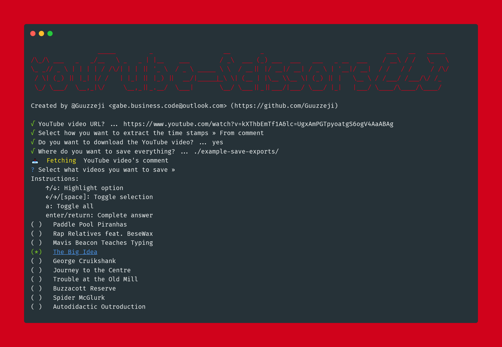

<p align="center">
    
</p>

<h1 align="center">YouTube-Scissors CLI</h1>

A simple cli-app that allows you to divide a YouTube video into multiple separate videos base on a video's time stamps. Built on top of another one of my projects, [yt-scissors](https://github.com/Guuzzeji/yt-scissors). 


## 💡 Features
- Can generate either a whole folder of videos or extracte a single video from a YouTube video
- Can trim / cut a video base on a YouTube video's chapters, description, or comment on the video. 
  - **Important:** Generated time codes from description and comment works about 85% of the time. Make sure video time codes are spaced out and have nothing that would make it hard to find the time codes. There is also a bug with any video that is +10 hours longs, so video length should be below 10 hours.
- Can download videos directly from CLI
  - **Note:** Downloading is slow compare to other YouTube download methods.
  - If you need good download speeds try [pytube](https://github.com/pytube/pytube) or [yt-dlp](https://github.com/yt-dlp/yt-dlp). You can still use this program with other YouTube download methods.
- Can edit already downloaded YouTube videos
- Simple CLI interface
- 100% Open Source (MIT license)


## 📂 How to Download & install

1. Download it [here](https://github.com/Guuzzeji/youtube-scissors-cli/releases) or go to the release tab of this repository.

2. Once you downloaded the youtube-scissors-cli executable, download ffmpeg. [FFmpeg Downloads](https://ffmpeg.org/download.html)
   
3. After downloading ffmpeg, open up the config.json file and paste the path to where you have saved the ffmpeg executable. Make sure you put config.json in the same directory as your executable. 

4. Additionally you can edit config.json to your liking. 

**Example of How config.json is setup**
```js
{
    "ffmpeg_path": "Your ffmpeg executable path goes here",
    "hide_ffmpeg": true, // hides ffmpeg logs
    "hide_yt_download": true, // hides download logs
    "hide_logo": false // hides youtube-scissors banner on startup
}
```


## 📷 Screenshot

<p align="center">
    
</p>


## 🛠️ Developer Instructuions (Build From Source)

> Most users do not need to build YouTube-Scissors CLI. You can download the builds from [here](https://github.com/Guuzzeji/yt-scissors). 

> If you are looking for API / wrapper libary for this cli app, look [here](https://github.com/Guuzzeji/yt-scissors).

### What you will need
- Download a copy of [ffmpeg](https://ffmpeg.org/download.html)
- Have [Node.js](https://nodejs.org/en/) install on your system
- (Optional) Have [git](https://git-scm.com/downloads) install on your system

### How To Build From Source

---

**(Step 1) Download the source code and cd into it**

```console
git clone https://github.com/Guuzzeji/youtube-scissors-cli.git
```
```console
cd youtube-scissors-cli
```
---

**(Step 2) Install pkg**

```console
npm install -g pkg
```
- [Learn more about pkg](https://github.com/vercel/pkg)

---

**(Step 3) Then run npm install to install all needed dependencies**

```console
npm install
```
---

**(Step 4) build using npm**

```console
npm run build
```

---

**(Step 5) Setting up config.json**

```console
cd build
```
- cd into the build directory and copy the "config.json" file into it. Make sure you edit the "config.json" file to your liking and type in the path to you ffmpeg executable.

---

### Helpful Infomation

How to find and get a YouTube comment url from a video 
- https://www.youtube.com/watch?v=PnmfkLiMLHs

### License

MIT


